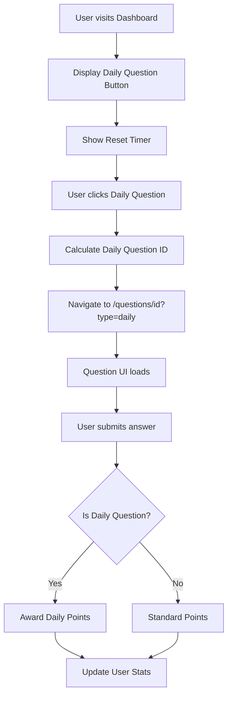

# Design Document: Daily Question Feature

## Overview

The Daily Question feature provides a shared daily challenge for all users, similar to LeetCode's daily problem. The system selects one question per day using a deterministic algorithm, resets at 8 AM GMT+7, and awards points based on difficulty. The implementation reuses existing UI components and database tables, requiring minimal new infrastructure.

### Key Design Principles

1. **Simplicity First**: No new database tables; leverage existing schema
2. **Deterministic Selection**: Same question for all users using date-based algorithm
3. **Component Reuse**: Utilize existing Question UI with minimal modifications
4. **Timezone Consistency**: All calculations in GMT+7 (Asia/Bangkok)

## Architecture

### High-Level Flow



### Component Architecture

```
┌─────────────────────────────────────────┐
│         Dashboard Page                   │
│  ┌───────────────────────────────────┐  │
│  │   DailyQuestionButton Component   │  │
│  │   - Shows reset countdown         │  │
│  │   - Calculates daily question     │  │
│  └───────────────────────────────────┘  │
└─────────────────────────────────────────┘
                    │
                    ▼
┌─────────────────────────────────────────┐
│      Question Page (?type=daily)        │
│  ┌───────────────────────────────────┐  │
│  │  IndividualQuestionPage Component │  │
│  │  - Detects daily mode             │  │
│  │  - Shows daily badge              │  │
│  └───────────────────────────────────┘  │
└─────────────────────────────────────────┘
                    │
                    ▼
┌─────────────────────────────────────────┐
│    API: /api/questions/[id]/attempt     │
│  - Detects daily question type          │
│  - Awards daily points                  │
│  - Prevents duplicate daily attempts    │
└─────────────────────────────────────────┘
```

## Components and Interfaces

### 1. Daily Question Selection Utility

**Location**: `lib/utils/dailyQuestion.ts`

```typescript
interface DailyQuestionConfig {
  salt: string
  timezone: string // 'Asia/Bangkok' for GMT+7
}

interface DailyQuestionResult {
  questionNumber: number
  questionId: string | null
  resetTime: Date
  timeUntilReset: string
}

// Core function to get today's question
function getDailyQuestion(date?: Date): Promise<DailyQuestionResult>

// Helper to calculate question number from date
function calculateDailyQuestionNumber(date: Date, salt: string): number

// Helper to get next reset time
function getNextResetTime(now?: Date): Date

// Helper to format time until reset
function formatTimeUntilReset(resetTime: Date): string

// Check if user has attempted today's daily question
function hasAttemptedDailyQuestion(userId: string, questionId: string): Promise<boolean>
```

**Algorithm Details**:
- Use current date in GMT+7 timezone (YYYY-MM-DD format)
- Combine date string with salt: `${dateString}-${salt}`
- Generate hash using simple algorithm (e.g., sum of char codes)
- Modulo by total active question count to get question number
- Query database for question with that number
- Fallback: if question doesn't exist, try adjacent numbers

### 2. Dashboard UI Updates

**Location**: `app/dashboard/page.tsx` and new component `components/dashboard/DailyQuestionButton.tsx`

**DailyQuestionButton Component**:
```typescript
interface DailyQuestionButtonProps {
  className?: string
}

// Component displays:
// - "Daily Question" button
// - Reset countdown timer
// - Question difficulty badge (optional)
// - Completion status (if already solved today)
```

**Features**:
- Real-time countdown to next reset (updates every minute)
- Visual indicator if user has completed today's question
- Smooth transition animation
- Responsive design for mobile

### 3. Question Page Enhancements

**Location**: `app/questions/[id]/page.tsx` and `components/questions/IndividualQuestionPage.tsx`

**URL Parameter Detection**:
- Read `type=daily` from URL search params
- Pass `isDailyQuestion` prop to IndividualQuestionPage
- Display "Daily Question" badge when in daily mode
- Show special messaging for daily challenges

**UI Modifications**:
```typescript
interface IndividualQuestionPageProps {
  question: QuestionWithTags
  isDailyQuestion?: boolean
}

// Additional UI elements for daily mode:
// - "Daily Challenge" badge
// - Points indicator (10/25/50 based on difficulty)
// - Special success message on completion
```

### 4. API Route Modifications

**Location**: `app/api/questions/[id]/attempt/route.ts`

**Enhanced Request Body**:
```typescript
interface AttemptRequestBody {
  selectedAnswer: OptionKey
  isDailyQuestion?: boolean
}
```

**Daily Question Logic**:
1. Check if `isDailyQuestion` flag is present
2. Verify the question is actually today's daily question (prevent cheating)
3. Check if user has already attempted today's daily question
4. Calculate points based on difficulty:
   - Easy: 10 points
   - Medium: 25 points
   - Hard: 50 points
5. Store attempt with daily question metadata
6. Update UserStats with daily points

**New API Endpoint** (optional): `app/api/daily-question/route.ts`
- GET: Returns today's daily question info (id, number, difficulty, reset time)
- Useful for dashboard and other components

## Data Models

### Existing Schema Usage

**Question Table**:
- Use `number` field for deterministic selection
- Use `difficulty` field for points calculation
- Use `isActive` field to filter available questions

**QuestionAttempt Table**:
- Store daily question attempts same as regular attempts
- Use `answeredAt` timestamp to track daily completion
- Query by userId + questionId + date to check daily completion

**UserStats Table**:
- Reuse existing fields for daily points tracking
- `totalCorrectAnswers` can represent daily points (1 point per correct answer)
- Consider: Add new optional fields in future if needed:
  - `dailyQuestionPoints: Int @default(0)`
  - `dailyQuestionStreak: Int @default(0)`
  - `lastDailyQuestionDate: DateTime?`

### Data Flow for Daily Points

```
User solves daily question (Easy)
    ↓
API validates it's today's daily question
    ↓
Check if user already solved today's daily
    ↓
Award 10 points (Easy difficulty)
    ↓
Update UserStats:
  - totalQuestionsAnswered += 1
  - totalCorrectAnswers += 1 (if correct)
  - easyCorrectAnswers += 1 (if correct)
  - currentStreak += 1 (if correct)
```

**Note**: For MVP, we'll track daily points implicitly through existing stats. Future enhancement could add dedicated daily question fields.

## Error Handling

### Edge Cases

1. **No questions available for calculated number**
   - Fallback: Try number + 1, then number - 1
   - Last resort: Select random active question with seed based on date

2. **User attempts same daily question multiple times**
   - Check existing attempts for today's date + question ID
   - Return error: "You've already attempted today's daily question"
   - Show completion status on dashboard

3. **Timezone edge cases**
   - Always use GMT+7 for consistency
   - Server-side calculation to prevent client timezone issues
   - Store reset time in UTC, convert for display

4. **Question becomes inactive after being selected**
   - Check `isActive` flag before serving
   - If inactive, recalculate with different seed

5. **User manipulates URL to claim daily points for wrong question**
   - Server validates question ID matches today's calculated daily question
   - Reject attempt if mismatch

### Error Messages

- "Today's daily question is not available" - Question selection failed
- "You've already completed today's daily question" - Duplicate attempt
- "This is not today's daily question" - URL manipulation detected
- "Daily question resets in X hours Y minutes" - Info message

## Testing Strategy

### Unit Tests

1. **Daily Question Selection Algorithm**
   - Test deterministic output for same date
   - Test different dates produce different questions
   - Test salt changes output
   - Test modulo wrapping with different question counts
   - Test fallback logic when question doesn't exist

2. **Time Calculations**
   - Test reset time calculation for various times of day
   - Test countdown formatting
   - Test timezone conversion (GMT+7)
   - Test date boundary conditions (11:59 PM, 12:00 AM, 8:00 AM)

3. **Points Calculation**
   - Test Easy = 10 points
   - Test Medium = 25 points
   - Test Hard = 50 points

### Integration Tests

1. **API Endpoint**
   - Test daily question attempt with valid data
   - Test duplicate attempt rejection
   - Test points awarded correctly
   - Test non-daily question still works
   - Test URL manipulation prevention

2. **Component Integration**
   - Test DailyQuestionButton renders correctly
   - Test countdown updates
   - Test navigation to question page
   - Test daily badge displays
   - Test completion status shows

### Manual Testing Checklist

- [ ] Daily question changes at 8 AM GMT+7
- [ ] All users see same question on same day
- [ ] Countdown timer displays correctly
- [ ] Points awarded match difficulty
- [ ] Cannot attempt same daily question twice
- [ ] Regular questions still work normally
- [ ] Mobile responsive design works
- [ ] Timezone handling correct for different user locations

## Implementation Notes

### Phase 1: Core Functionality
1. Create daily question utility functions
2. Add API endpoint for daily question info
3. Modify attempt API to handle daily questions
4. Basic points calculation

### Phase 2: UI Integration
1. Create DailyQuestionButton component
2. Update dashboard to show daily question
3. Add daily mode to question page
4. Implement countdown timer

### Phase 3: Polish
1. Add animations and transitions
2. Improve error messages
3. Add completion indicators
4. Performance optimization

### Configuration

**Constants** (`lib/utils/dailyQuestion.ts`):
```typescript
const DAILY_QUESTION_CONFIG = {
  salt: 'anton-daily-question-2024', // Hardcoded salt for deterministic selection
  timezone: 'Asia/Bangkok', // GMT+7
  resetHour: 8, // 8 AM
  resetMinute: 0,
}

const DAILY_POINTS = {
  EASY: 10,
  MEDIUM: 25,
  HARD: 50,
} as const
```

## Security Considerations

1. **Server-side validation**: Always validate daily question ID on server
2. **Rate limiting**: Prevent spam attempts on daily questions
3. **Attempt verification**: Check user hasn't already completed today's daily
4. **Timezone consistency**: Use server time, not client time

## Performance Considerations

1. **Caching**: Cache today's daily question ID (invalidate at reset time)
2. **Database queries**: Index on `number` field for fast lookups
3. **Countdown updates**: Use client-side timer, update every minute (not every second)
4. **Lazy loading**: Load daily question info only when dashboard is visible

## Future Enhancements

1. **Daily Question History**: Show calendar of past daily questions
2. **Streak Tracking**: Dedicated daily question streak counter
3. **Leaderboard**: Daily question completion leaderboard
4. **Notifications**: Remind users about new daily question
5. **Social Features**: Share daily question results
6. **Analytics**: Track daily question completion rates
7. **Difficulty Rotation**: Ensure balanced difficulty distribution over time
