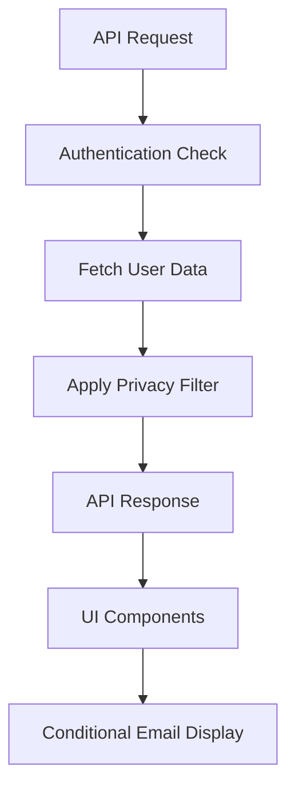
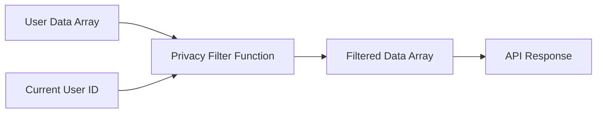

# Email Privacy Protection Design

## Overview

This design implements comprehensive email privacy protection across both API responses and UI components. The solution ensures that user email addresses are only visible to the respective user and not exposed to other users in leaderboards, profiles, or any other user-facing interfaces.

The implementation consists of two main components:
1. **Server-side Privacy Filter**: A utility function that conditionally filters email data in API responses
2. **Client-side Privacy Handling**: UI component modifications to handle and display email data appropriately

## Architecture

### High-Level Flow



### Privacy Filter Architecture



## Components and Interfaces

### 1. Server-Side Privacy Filter

**Location**: `lib/utils/privacy.ts`

**Interface**:
```typescript
interface UserDataWithEmail {
  userId: string
  userEmail: string
  [key: string]: any
}

interface PrivacyFilterOptions {
  currentUserId?: string
  preserveEmailForCurrentUser?: boolean
}

function filterEmailPrivacy<T extends UserDataWithEmail>(
  userData: T[],
  options: PrivacyFilterOptions = {}
): T[]
```

**Functionality**:
- Accepts an array of user data objects containing email fields
- Takes current user ID as parameter
- Returns modified array where email fields are conditionally included
- Preserves all other data fields unchanged
- Handles null/undefined email values gracefully

### 2. API Endpoint Modifications

**Affected Endpoints**:
- `/api/scoreboard/route.ts`
- `/api/scoreboard/daily-points/route.ts` 
- `/api/scoreboard/questions-solved/route.ts`
- `/api/user/stats/route.ts` (no changes needed - already user-specific)

**Implementation Pattern**:
```typescript
// Before response
const filteredData = filterEmailPrivacy(userData, {
  currentUserId: user?.id,
  preserveEmailForCurrentUser: true
})

return NextResponse.json(filteredData)
```

### 3. UI Component Modifications

**Affected Components**:
- `components/shared/UserWithAvatar.tsx`
- `components/shared/UserAvatar.tsx`
- `components/scoreboard/QuestionsSolvedLeaderboard.tsx`
- `components/profile/UserProfileHeader.tsx`
- `components/dashboard/LeaderboardTable.tsx`

**Privacy Handling Strategy**:
- Components receive filtered data from API (emails already removed for other users)
- Components handle cases where `userEmail` might be null/undefined
- Fallback display names are generated from available data (displayName, userId, or placeholder)
- Email display is conditional based on data availability

## Data Models

### Current User Data Structure
```typescript
interface LeaderboardEntry {
  rank: number
  userId: string
  userEmail: string | null  // Now conditional based on privacy filter
  avatarUrl: string | null
  displayName: string | null
  totalCorrectAnswers: number
  totalQuestionsAnswered: number
  accuracyPercentage: number
  currentLevel: number
  currentTitle: string
  totalXp: number
  updatedAt: Date
}
```

### Privacy Filter Response
```typescript
// For current user
{
  userId: "user-123",
  userEmail: "user@example.com",  // Preserved
  displayName: "John Doe",
  // ... other fields
}

// For other users
{
  userId: "user-456", 
  userEmail: null,  // Filtered out
  displayName: "Jane Smith",
  // ... other fields
}
```

## Error Handling

### Server-Side Error Handling
1. **Authentication Failures**: If user authentication fails, all email fields are filtered out
2. **Null/Undefined Emails**: Privacy filter handles null/undefined email values gracefully
3. **Missing User Context**: When current user ID is not available, all emails are filtered

### Client-Side Error Handling
1. **Missing Email Data**: Components fall back to displayName or generate placeholder text
2. **Avatar Generation**: UserAvatar component handles missing email by using userId or displayName for color generation
3. **Display Name Fallbacks**: Priority order: displayName → email username → userId → "Anonymous User"

## Testing Strategy

### Unit Tests
1. **Privacy Filter Function Tests**:
   - Test email filtering for current user vs other users
   - Test handling of null/undefined emails
   - Test preservation of non-email fields
   - Test edge cases (empty arrays, missing user ID)

2. **Component Tests**:
   - Test UserWithAvatar with and without email data
   - Test UserAvatar fallback behavior
   - Test leaderboard rendering with filtered data

### Integration Tests
1. **API Endpoint Tests**:
   - Test scoreboard endpoints return filtered email data
   - Test current user receives their own email
   - Test unauthenticated requests receive no emails

2. **End-to-End Tests**:
   - Test leaderboard displays correctly for authenticated users
   - Test email privacy in different user contexts
   - Test UI gracefully handles missing email data

## Implementation Considerations

### Performance Impact
- Privacy filtering adds minimal overhead (single array iteration)
- No additional database queries required
- Client-side rendering remains unchanged

### Backward Compatibility
- API response structure remains the same (email field still present, just conditionally null)
- UI components already handle optional email fields in some cases
- No breaking changes to existing interfaces

### Security Considerations
- Email filtering happens server-side before response transmission
- No sensitive data exposed in client-side code
- Authentication state properly validated before filtering decisions

### Scalability
- Privacy filter function is stateless and can handle large datasets
- No caching implications (filtering happens per request)
- Minimal memory footprint for filtering logic

## Migration Strategy

### Phase 1: Server-Side Implementation
1. Create privacy filter utility function
2. Implement in scoreboard API endpoints
3. Test API responses for correct email filtering

### Phase 2: Client-Side Hardening
1. Update UI components to handle null email values
2. Implement fallback display logic
3. Test UI rendering with filtered data

### Phase 3: Validation and Cleanup
1. End-to-end testing of privacy protection
2. Performance validation
3. Documentation updates