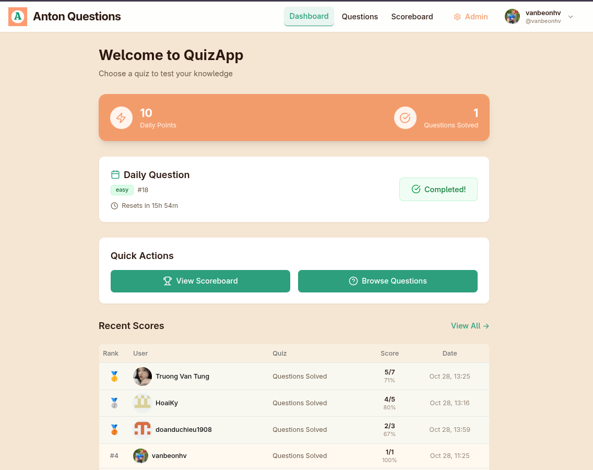
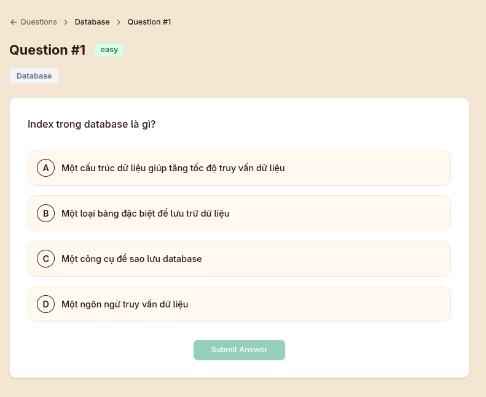
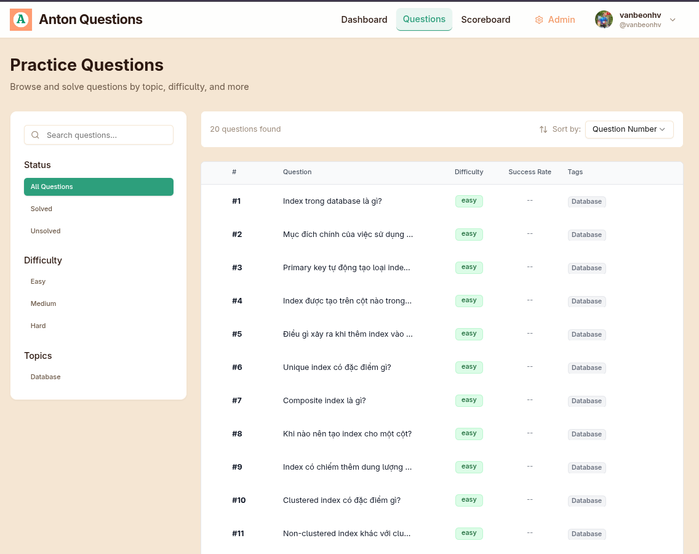
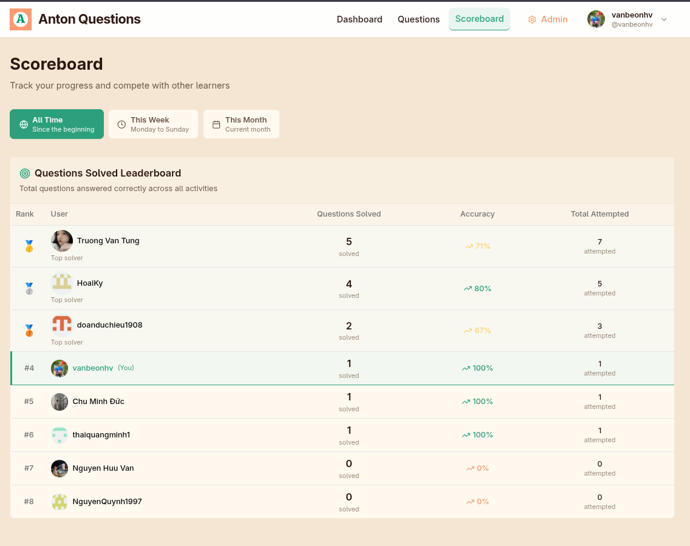

# Anton Questions App

A modern quiz and questions practice application built for interactive learning and knowledge assessment. Practice questions across different difficulty levels, track your progress, and compete on the leaderboard.

## ✨ Features

- **Question Practice**: Answer questions across Easy, Medium, and Hard difficulty levels
- **Daily Question**: A new question every day with a shareable URL (`/daily`)
- **Progress Tracking**: Comprehensive statistics including streaks and accuracy rates
- **Tagging System**: Organized questions with filtering capabilities
- **Real-time Feedback**: Immediate feedback with explanations
- **Leaderboard**: User rankings based on performance metrics
- **Admin Panel**: Administrative interface for content management

## 🛠️ Tech Stack

<div align="center">


</div>

## 📸 Screenshots

### Dashboard


### Question Practice


### Question List


### Scoreboard


## 🚀 Getting Started

### Prerequisites

- Node.js 18+ 
- pnpm (recommended) or npm
- PostgreSQL database (or Supabase account)

### Installation

1. Clone the repository
```bash
git clone <repository-url>
cd anton-quiz
```

2. Install dependencies
```bash
pnpm install
```

3. Set up environment variables
```bash
cp .env.example .env.local
# Edit .env.local with your database and Supabase credentials
```

4. Set up the database
```bash
npx prisma migrate dev --name init
npx prisma db seed
```

5. Start the development server
```bash
pnpm dev
```

Open [http://localhost:4000](http://localhost:4000) to view the application.

### Daily Question Sharing

The daily question can be easily shared using the dedicated URL:
- **Direct access**: `/daily` - Automatically redirects to today's question
- **API redirect**: `/api/daily-question/redirect` - Programmatic redirect with authentication

## 🐳 Docker Deployment

Build and run with Docker:

```bash
docker-compose up --build
```

## 📝 Available Scripts

- `pnpm dev` - Start development server
- `pnpm build` - Build for production
- `pnpm start` - Start production server
- `pnpm lint` - Run ESLint
- `npx prisma studio` - Open database GUI
- `npx prisma db seed` - Seed database with sample data

## 🏗️ Project Structure

```
├── app/                    # Next.js App Router pages
├── components/             # React components
├── lib/                    # Utilities and database
├── prisma/                 # Database schema and migrations
├── types/                  # TypeScript definitions
└── public/                 # Static assets
```
